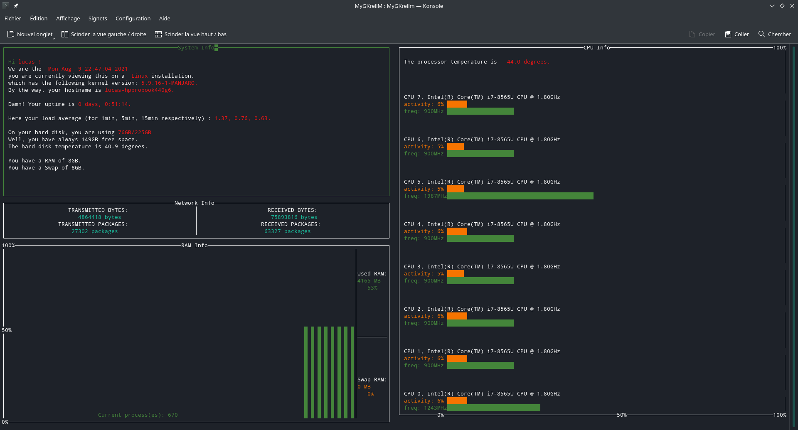

# MyGKrellM

GNU Krell Monitors (GKrellM) is a System monitor software based on the GNU Krell Monitors (GKrellM), a GTK+ toolkit that creates a single process stack of system monitors.

It is possible to start the system monitor either in “text” or in “graphical” mode, with the same functionalities.
In “text” mode, your monitor will be displayed on your terminal, with the <strong>ncurses</strong> library.
In “graphical” mode, your monitor must be displayed in a graphical window, with the <strong>SFML</strong> library.

<h3>Usage</h3>
./MyGKrellm mode

<h3>Mode description</h3>
<strong>--tests</strong> <em>to run units tests</em>. 
<strong>--text-mode</strong> <em>to run MyGKrellm in text mode</em>. 

    

<strong>--graphical-mode</strong> <em>to run MyGKrellm in graphical mode</em>. 

    

<h3>Option</h3>
"-h" to display the help page. 
